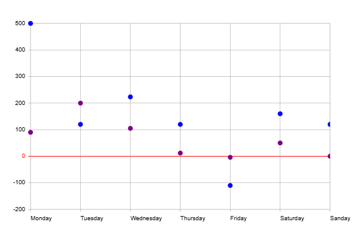
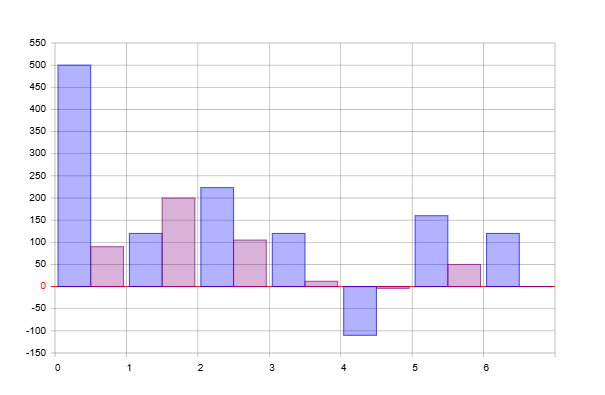
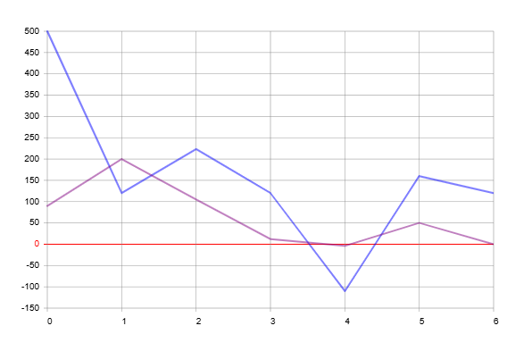

# CHART 
Biblioteka do generowania wykresów

## Obsługiwane typy wykresów
* Punktowy
* Słupkowy
* Liniowy

### Punktowy


### Słupkowy


### Liniowy



## Dokumentacja

### Objekt chart

| Klucz | Typ | Opis|
|--------------|--------------|--------------|
| labels  | array[string \| number] | etykieta dla osi X  |
| type  | string ['point' \| 'bar' \| 'line' ]  | typ wykresu  |
| datasets | array[object] | lista wykresów do wyświetlenia|
| axis | object | ustawienia osi x i y |

### Objekt dataset
| Klucz | Typ | Opis |
|------------|------------|------------|
| label | string | nazwa wykresu |
| data | array[number] | wartości dal osi Y |
| color | string | kolor wykresu rgba, hex |

### Objekt axis.y
| Klucz | Typ | Opis |
|------------|------------|------------|
| y1 | number | dolny zakres osi Y |
| y2 | number | górny zakres osi Y |
| step | number | odległość między liniami na osi Y|


Przykład: 
```javascript
const chart = new Chart('myChart', {
    labels:[ 'Monday', 'Tuesday', 'Wednesday', 'Thursday', 'Friday', 'Saturday', 'Sanday'],
    type: 'point',
    datasets: [
        {
            label:'Wykres 1',
            data: [500, 120, 200, 120, -110, 160, 120],
            color: 'blue'
        },
        {
            label:'Wykres 2',
            data: [90, 200, 105, 12, -4, 50, 0],
            color: 'purple'
        },
        {
            label:'Wykres 3',
            data: [300, 120, -50, -10, -44, -150, 0],
            color: 'green'
        },
    ],
    axis: {
        y: {
            y1: -200,
            y2: 500,
            step: 100
        }
    }
});
```